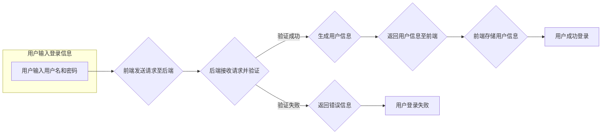

```mermaid
graph LR
  subgraph 用户输入登录信息
    A[用户输入用户名和密码]
  end
  A --> B{前端发送请求至后端}
  B --> C{后端接收请求并验证}
  C -->|验证成功| D{生成用户信息}
  C -->|验证失败| E{返回错误信息}
  D --> F{返回用户信息至前端}
  F --> G{前端存储用户信息}
  G --> H[用户成功登录]
  E --> I[用户登录失败]

```