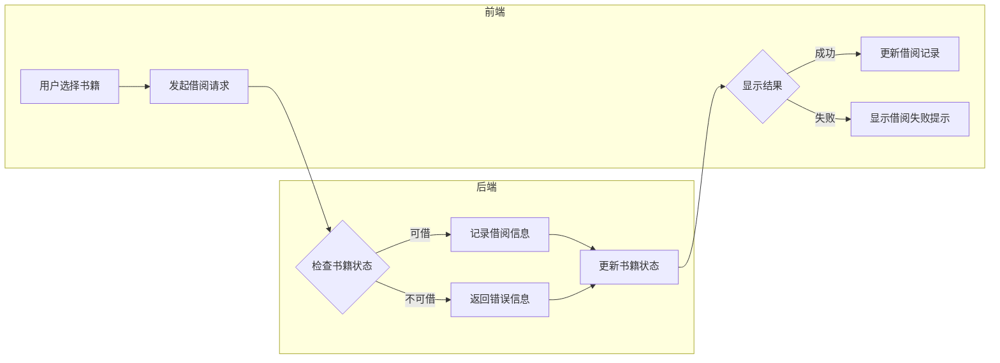

```mermaid
graph LR
  subgraph 前端
    A[用户选择书籍] --> B[发起借阅请求]
  end
  subgraph 后端
    B --> C{检查书籍状态}
    C -- 可借 --> D[记录借阅信息]
    C -- 不可借 --> E[返回错误信息]
    D --> F[更新书籍状态]
    E --> F
  end
  subgraph 前端
    F --> G{显示结果}
    G -- 成功 --> H[更新借阅记录]
    G -- 失败 --> I[显示借阅失败提示]
  end
```