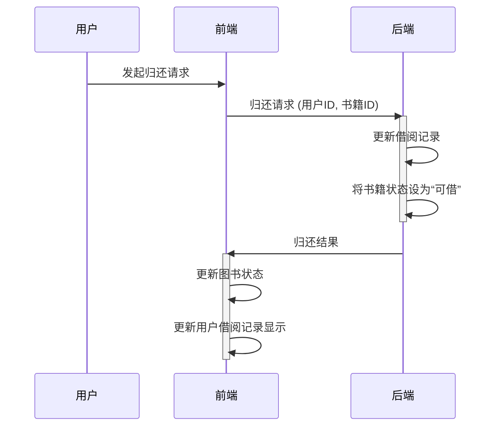

```mermaid
sequenceDiagram
    participant 用户
    participant 前端
    participant 后端

    用户->>前端: 发起归还请求
    前端->>后端: 归还请求 (用户ID, 书籍ID)
    activate 后端
    后端->>后端: 更新借阅记录
    后端->>后端: 将书籍状态设为“可借”
    deactivate 后端
    后端->>前端: 归还结果
    activate 前端
    前端->>前端: 更新图书状态
    前端->>前端: 更新用户借阅记录显示
    deactivate 前端
```