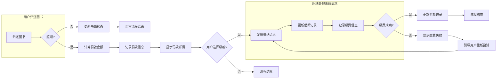

```mermaid
graph LR
    subgraph 用户归还图书
        A[归还图书] --> B{超期?}
    end
    B -- 否 --> C[更新书籍状态]
    C --> D[正常流程结束]
    B -- 是 --> E[计算罚款金额]
    E --> F[记录罚款信息]
    F --> G[显示罚款详情]
    G --> H{用户选择缴纳?}
    H -- 否 --> I[流程结束]
    H -- 是 --> J[发送缴纳请求]
    subgraph 后端处理缴纳请求
        J --> K[更新借阅记录]
        K --> L[记录缴费信息]
        L --> M{缴费成功?}
    end
    M -- 是 --> N[更新罚款记录]
    N --> O[流程结束]
    M -- 否 --> P[显示缴费失败]
    P --> Q[引导用户重新尝试]
    Q --> J
```