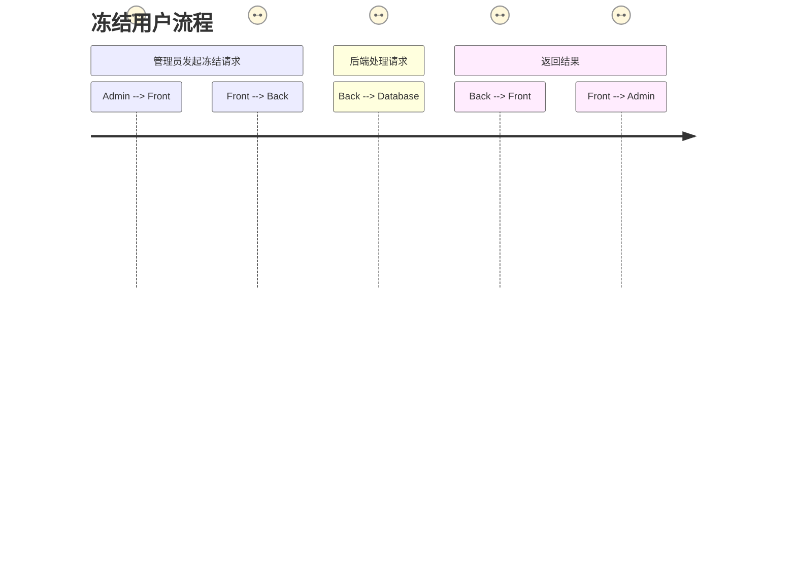

```mermaid
journey
  title 冻结用户流程
  section 管理员发起冻结请求
    Admin --> Front: 选择需要冻结的用户
    Front --> Back: 发送冻结请求 (管理员ID, 用户ID)
  section 后端处理请求
    Back --> Database: 将用户状态设为“冻结”
  section 返回结果
    Back --> Front: 返回冻结成功提示
    Front --> Admin: 更新用户状态
```