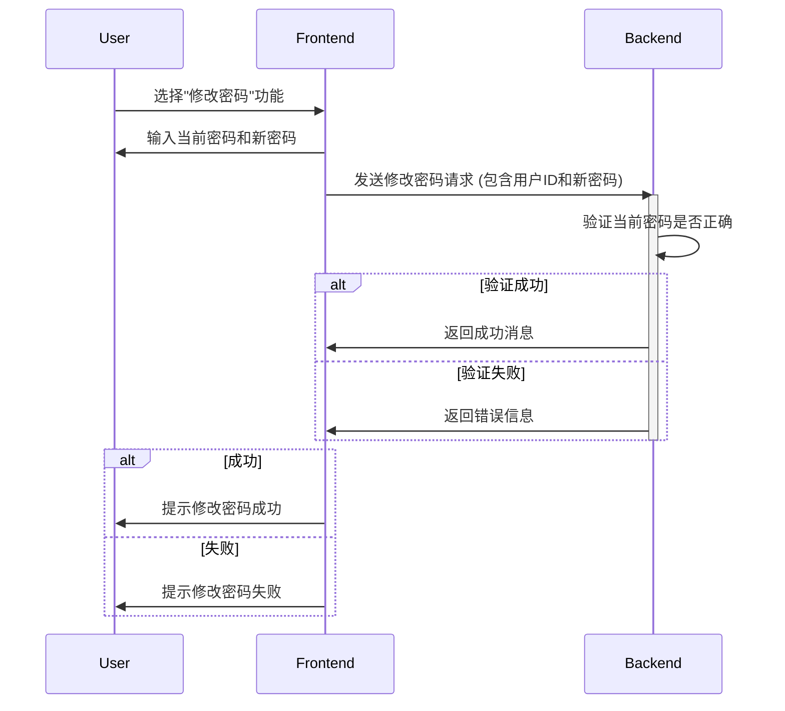

```mermaid
sequenceDiagram
    participant User
    participant Frontend
    participant Backend

    User->>Frontend: 选择"修改密码"功能
    Frontend->>User: 输入当前密码和新密码
    Frontend->>Backend: 发送修改密码请求 (包含用户ID和新密码)
    activate Backend
    Backend->>Backend: 验证当前密码是否正确
    alt 验证成功
        Backend->>Frontend: 返回成功消息
    else 验证失败
        Backend->>Frontend: 返回错误信息
    end
    deactivate Backend
    alt 成功
        Frontend->>User: 提示修改密码成功
    else 失败
        Frontend->>User: 提示修改密码失败
    end
```