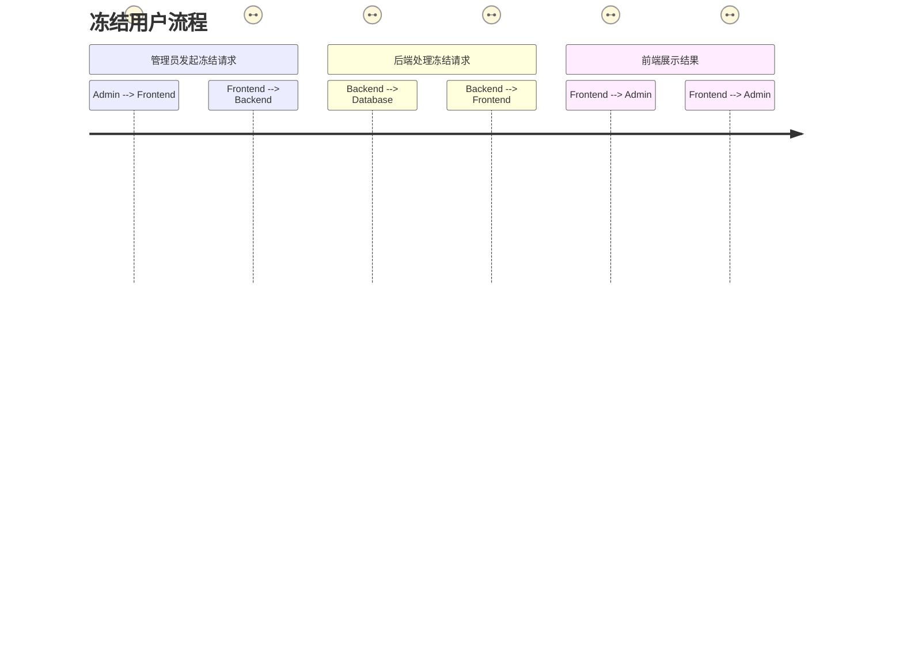

```mermaid
journey
    title 冻结用户流程
    section 管理员发起冻结请求
      Admin --> Frontend: 选择需要冻结的用户
      Frontend --> Backend: 发送冻结请求（管理员ID，用户ID）
    section 后端处理冻结请求
      Backend --> Database: 更新用户状态为“冻结”
      Backend --> Frontend: 返回冻结结果
    section 前端展示结果
      Frontend --> Admin: 显示冻结成功提示
      Frontend --> Admin: 更新用户状态
```