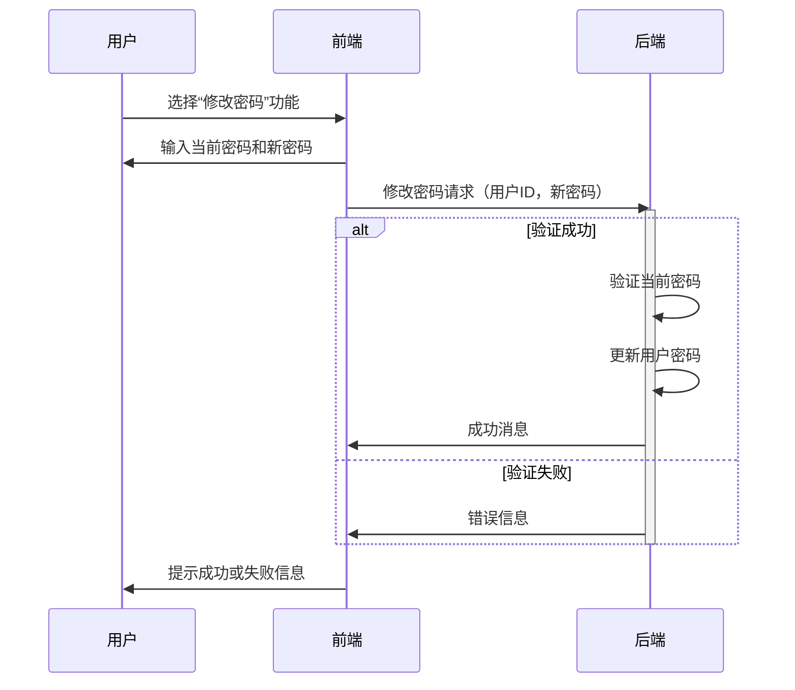

```mermaid
sequenceDiagram
    participant 用户
    participant 前端
    participant 后端

    用户->>前端: 选择“修改密码”功能
    前端->>用户: 输入当前密码和新密码
    前端->>后端: 修改密码请求（用户ID，新密码）
    activate 后端
    alt 验证成功
        后端->>后端: 验证当前密码
        后端->>后端: 更新用户密码
        后端->>前端: 成功消息
    else 验证失败
        后端->>前端: 错误信息
    end
    deactivate 后端
    前端->>用户: 提示成功或失败信息
```