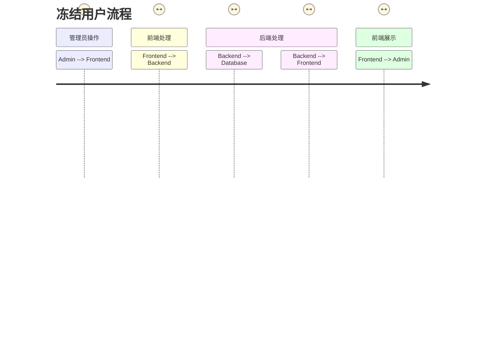

```mermaid
journey
  title 冻结用户流程
  section 管理员操作
    Admin --> Frontend: 发起冻结请求
  section 前端处理
    Frontend --> Backend: 发送冻结请求（包含管理员ID和用户ID）
  section 后端处理
    Backend --> Database: 更新用户状态为“冻结”
    Backend --> Frontend: 返回结果
  section 前端展示
    Frontend --> Admin: 显示冻结成功提示并更新用户状态
```