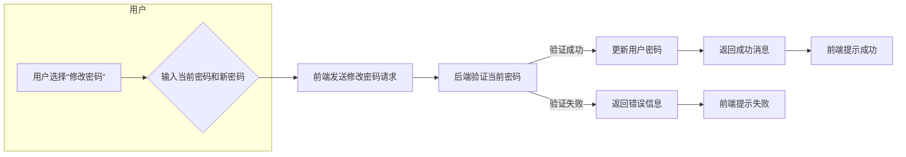

```mermaid
graph LR
    subgraph 用户
        A[用户选择“修改密码”] --> B{输入当前密码和新密码}
    end
    B --> C[前端发送修改密码请求]
    C --> D[后端验证当前密码]
    D -- 验证成功 --> E[更新用户密码]
    E --> F[返回成功消息]
    F --> G[前端提示成功]
    D -- 验证失败 --> H[返回错误信息]
    H --> I[前端提示失败]
```