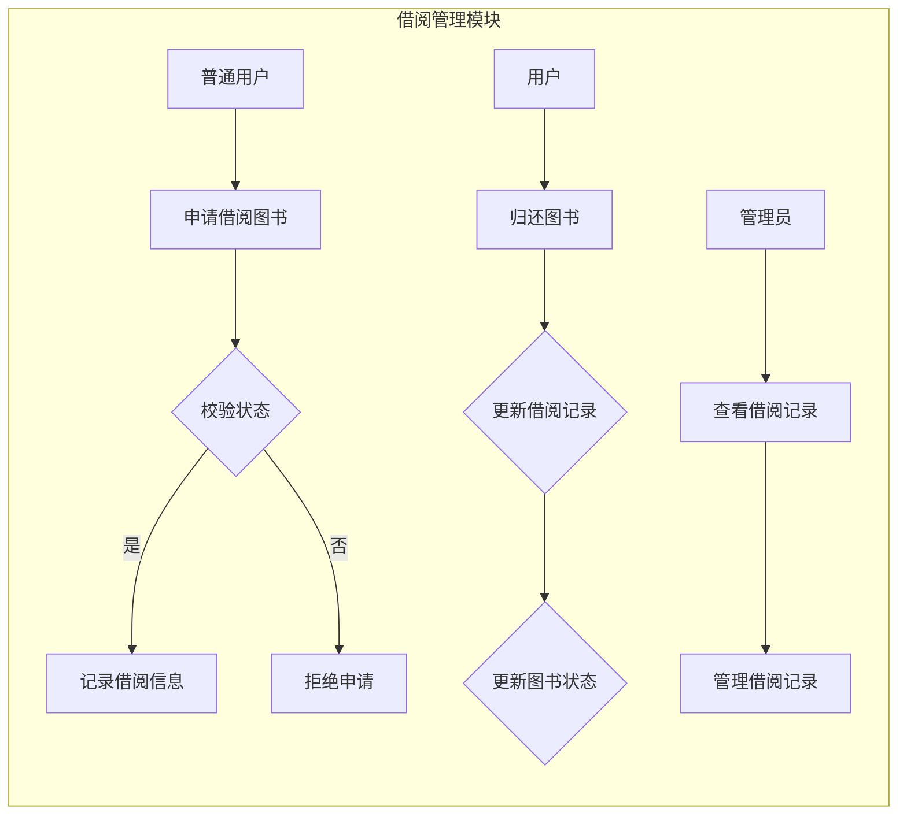

```mermaid
graph LR
    subgraph 借阅管理模块
        A[普通用户] --> B[申请借阅图书]
        B --> C{校验状态}
        C -- 是 --> D[记录借阅信息]
        C -- 否 --> E[拒绝申请]
        F[用户] --> G[归还图书]
        G --> H{更新借阅记录}
        H --> I{更新图书状态}
        J[管理员] --> K[查看借阅记录]
        K --> L[管理借阅记录]
    end
```