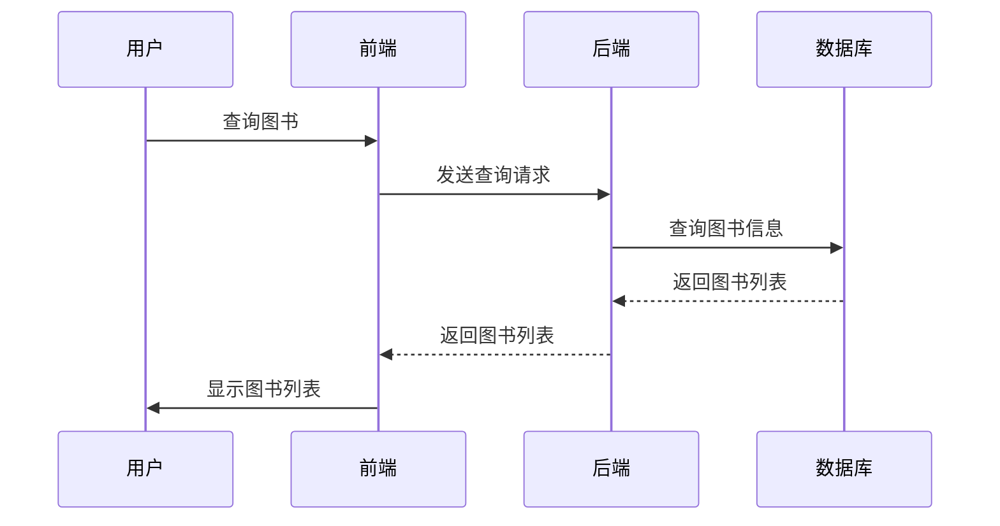

```mermaid
sequenceDiagram
    participant 用户
    participant 前端
    participant 后端
    participant 数据库

    用户->>前端: 查询图书
    前端->>后端: 发送查询请求
    后端->>数据库: 查询图书信息
    数据库-->>后端: 返回图书列表
    后端-->>前端: 返回图书列表
    前端->>用户: 显示图书列表
```