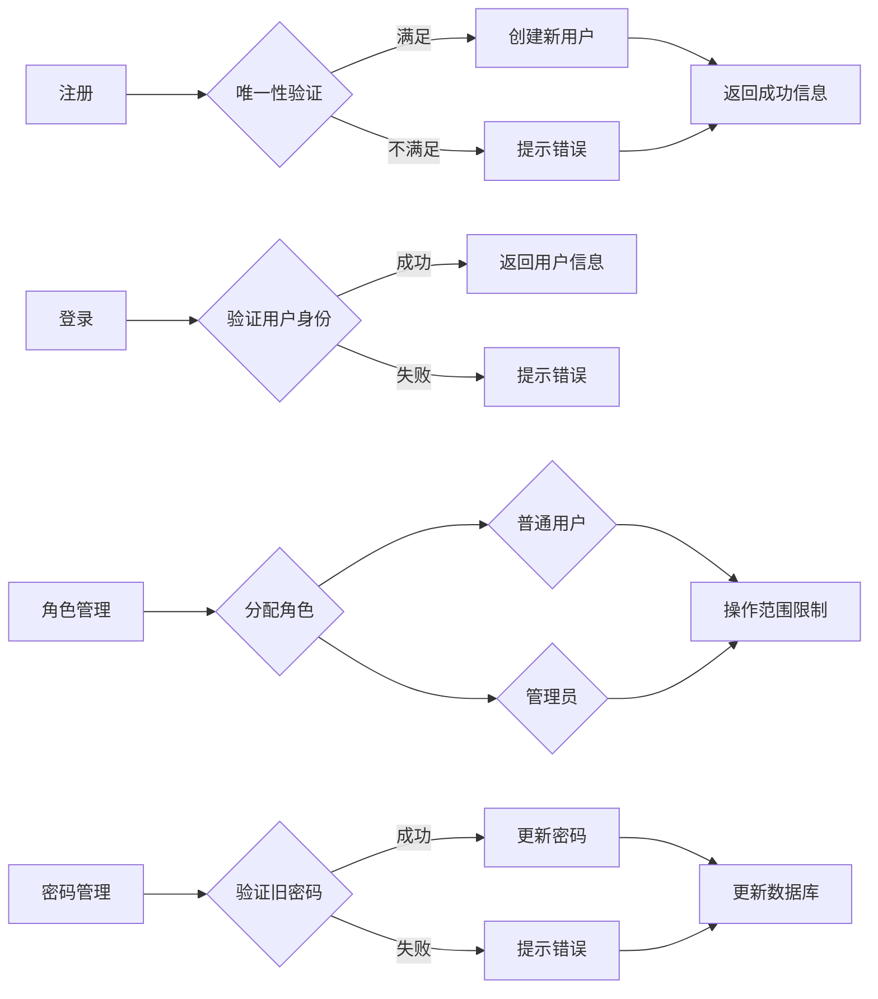

```mermaid
graph LR
    A[注册] --> B{唯一性验证}
    B -- 满足 --> C[创建新用户]
    B -- 不满足 --> D[提示错误]
    C --> E[返回成功信息]
    D --> E
    F[登录] --> G{验证用户身份}
    G -- 成功 --> H[返回用户信息]
    G -- 失败 --> I[提示错误]
    J[角色管理] --> K{分配角色}
    K --> L{普通用户}
    K --> M{管理员}
    L --> N[操作范围限制]
    M --> N
    O[密码管理] --> P{验证旧密码}
    P -- 成功 --> Q[更新密码]
    P -- 失败 --> R[提示错误]
    Q --> S[更新数据库]
    R --> S
```