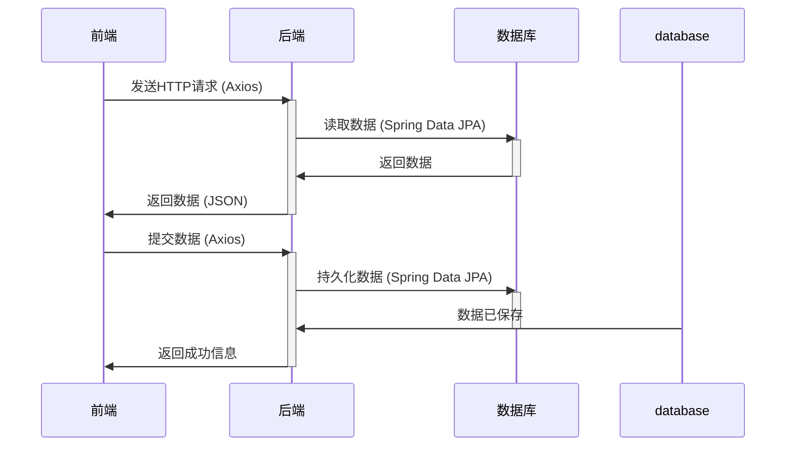

```mermaid
sequenceDiagram
    participant 前端
    participant 后端
    participant 数据库

    前端->>后端: 发送HTTP请求 (Axios)
    activate 后端
    后端->>数据库: 读取数据 (Spring Data JPA)
    activate 数据库
    数据库->>后端: 返回数据
    deactivate 数据库
    后端->>前端: 返回数据 (JSON)
    deactivate 后端

    前端->>后端: 提交数据 (Axios)
    activate 后端
    后端->>数据库: 持久化数据 (Spring Data JPA)
    activate 数据库
    database->>后端: 数据已保存
    deactivate 数据库
    后端->>前端: 返回成功信息
    deactivate 后端
```