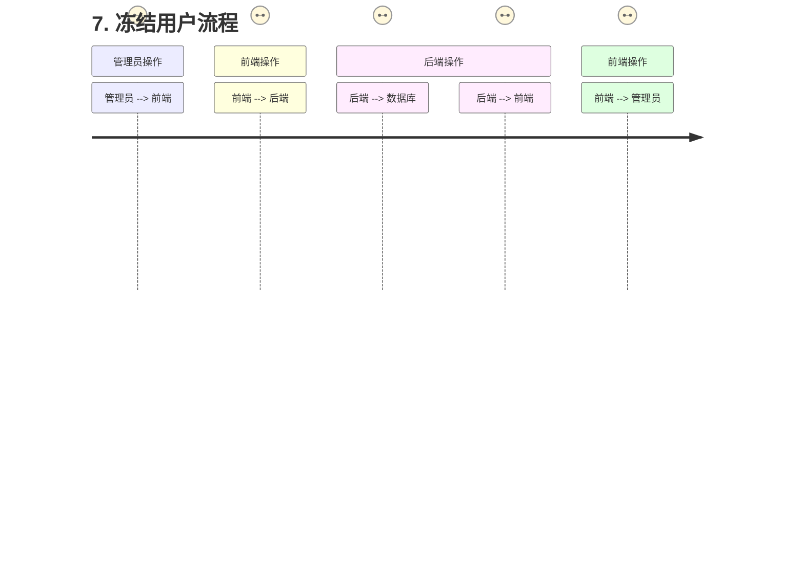

```mermaid
journey
    title 7. 冻结用户流程
    section 管理员操作
      管理员 --> 前端: 选择用户，发起冻结请求
    section 前端操作
      前端 --> 后端: 发送冻结请求 (管理员ID, 用户ID)
    section 后端操作
      后端 --> 数据库: 设置用户状态为“冻结”，更新记录
      后端 --> 前端: 返回结果
    section 前端操作
      前端 --> 管理员: 显示冻结成功提示，更新用户状态
```