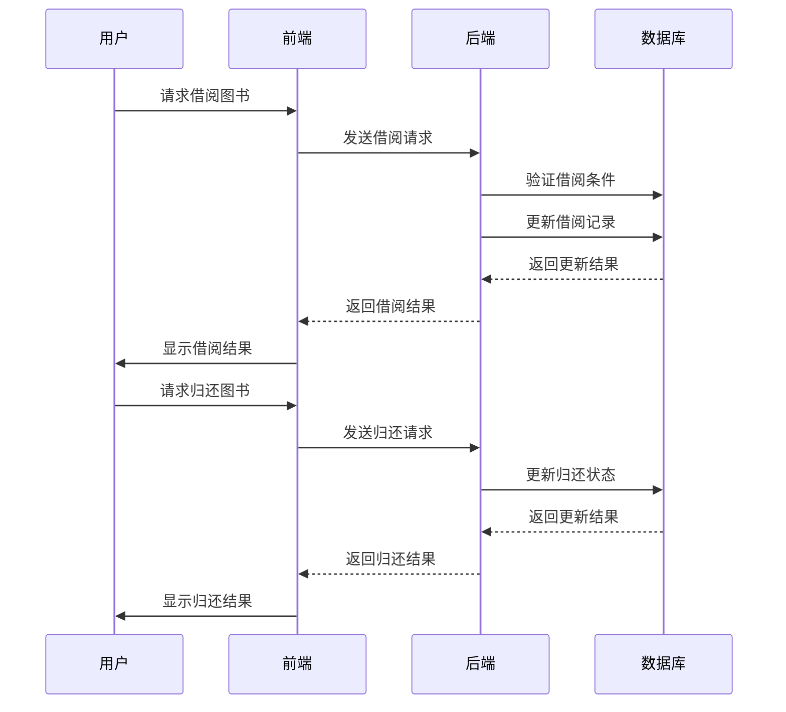

```mermaid
sequenceDiagram
  participant 用户
  participant 前端
  participant 后端
  participant 数据库

  用户->>前端: 请求借阅图书
  前端->>后端: 发送借阅请求
  后端->>数据库: 验证借阅条件
  后端->>数据库: 更新借阅记录
  数据库-->>后端: 返回更新结果
  后端-->>前端: 返回借阅结果
  前端->>用户: 显示借阅结果

  用户->>前端: 请求归还图书
  前端->>后端: 发送归还请求
  后端->>数据库: 更新归还状态
  数据库-->>后端: 返回更新结果
  后端-->>前端: 返回归还结果
  前端->>用户: 显示归还结果
```