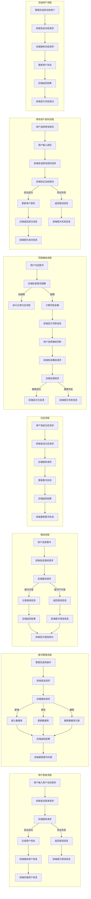

```mermaid
graph LR
    subgraph 用户登录流程
        A[用户输入用户名和密码] --> B[前端发送登录请求]
        B --> C[后端接收请求]
        C -->|验证成功| D[生成用户信息]
        C -->|验证失败| E[返回错误信息]
        D --> F[前端接收用户信息]
        E --> G[前端提示错误信息]
        F --> H[前端存储用户信息]
    end

    subgraph 图书管理流程
        I[管理员选择操作] --> J[前端发送请求]
        J --> K[后端接收请求]
        K -->|新增| L[插入数据库]
        K -->|修改| M[更新数据库]
        K -->|删除| N[删除数据库记录]
        L --> O[后端返回结果]
        M --> O
        N --> O
        O --> P[前端更新图书列表]
    end

    subgraph 借阅流程
        Q[用户选择图书] --> R[前端发送借阅请求]
        R --> S[后端接收请求]
        S -->|图书可借| T[记录借阅信息]
        S -->|图书不可借| U[返回错误信息]
        T --> V[后端返回结果]
        U --> W[前端提示错误信息]
        V --> X[前端显示借阅成功]
        W --> X
    end

    subgraph 归还流程
        Y[用户发起归还请求] --> Z[前端发送归还请求]
        Z --> AA[后端接收请求]
        AA --> AB[更新图书状态]
        AB --> AC[后端返回结果]
        AC --> AD[前端更新图书状态]
    end

    subgraph 罚款缴纳流程
        AE[用户归还图书] --> AF[后端检查是否超期]
        AF -->|未超期| AG[执行正常归还流程]
        AF -->|超期| AH[计算罚款金额]
        AH --> AI[前端显示罚款信息]
        AI --> AJ[用户选择缴纳罚款]
        AJ --> AK[前端发送缴纳请求]
        AK --> AL[后端处理请求]
        AL -->|缴费成功| AM[前端显示已结清]
        AL -->|缴费失败| AN[前端提示失败信息]
    end

    subgraph 修改用户密码流程
        AO[用户选择修改密码] --> AP[用户输入密码]
        AP --> AQ[前端发送修改密码请求]
        AQ --> AR[后端验证当前密码]
        AR -->|验证成功| AS[更新用户密码]
        AR -->|验证失败| AT[返回错误信息]
        AS --> AU[后端返回成功消息]
        AT --> AV[前端提示失败信息]
        AU --> AW[前端提示成功信息]
    end

    subgraph 冻结用户流程
        AX[管理员选择冻结用户] --> AY[前端发送冻结请求]
        AY --> AZ[后端接收冻结请求]
        AZ --> BA[更新用户状态]
        BA --> BB[后端返回结果]
        BB --> BC[前端显示冻结成功]
    end
```