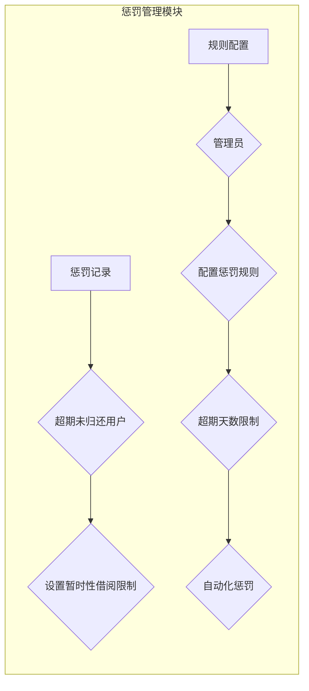

```mermaid
graph LR
    subgraph 惩罚管理模块
        A[惩罚记录] --> B{超期未归还用户}
        B --> C{设置暂时性借阅限制}
        D[规则配置] --> E{管理员}
        E --> F{配置惩罚规则}
        F --> G{超期天数限制}
        G --> H{自动化惩罚}
    end
```