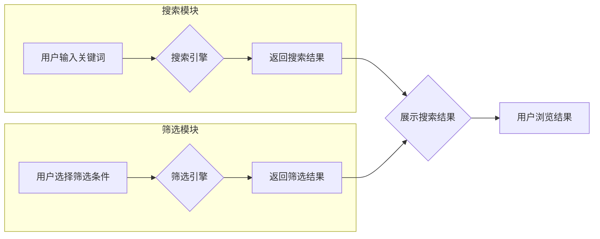

```mermaid
graph LR
    subgraph 搜索模块
        A[用户输入关键词] --> B{搜索引擎}
        B --> C[返回搜索结果]
    end
    subgraph 筛选模块
        D[用户选择筛选条件] --> E{筛选引擎}
        E --> F[返回筛选结果]
    end
    C --> G{展示搜索结果}
    F --> G
    G --> H[用户浏览结果]
```