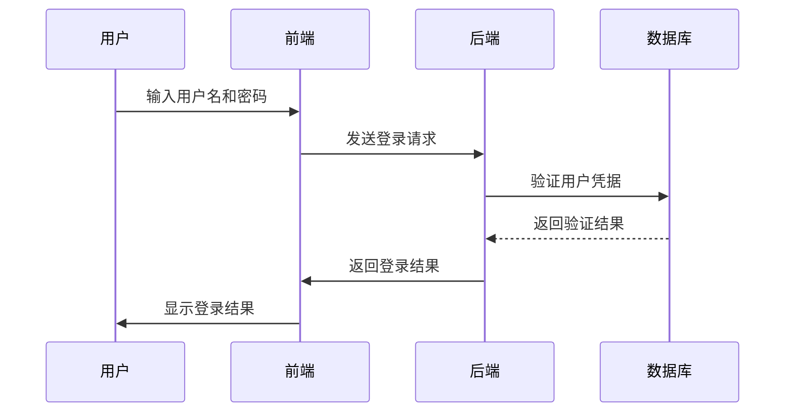

```mermaid
sequenceDiagram
    participant 用户
    participant 前端
    participant 后端
    participant 数据库

    用户->>前端: 输入用户名和密码
    前端->>后端: 发送登录请求
    后端->>数据库: 验证用户凭据
    数据库-->>后端: 返回验证结果
    后端->>前端: 返回登录结果
    前端->>用户: 显示登录结果
```