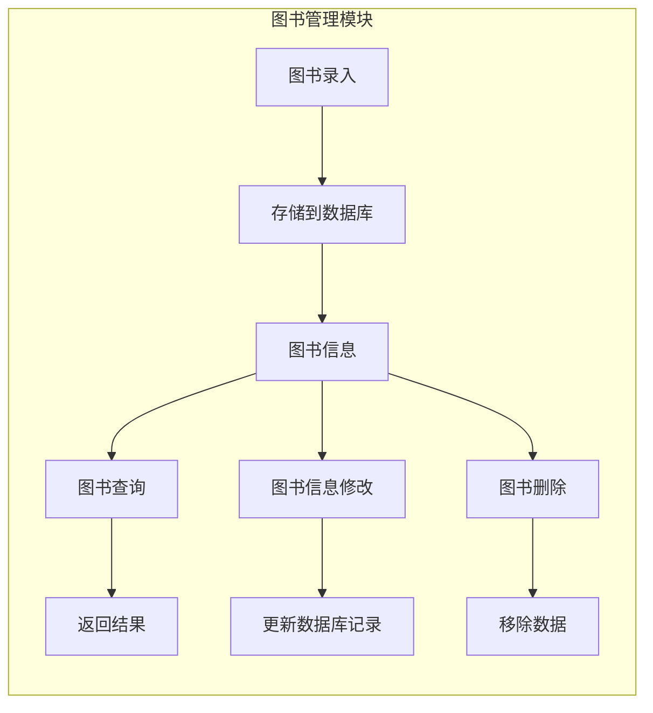

```mermaid
graph LR
    subgraph 图书管理模块
        A[图书录入] --> B[存储到数据库]
        B --> C[图书信息]
        C --> D[图书查询]
        D --> E[返回结果]
        C --> F[图书信息修改]
        F --> G[更新数据库记录]
        C --> H[图书删除]
        H --> I[移除数据]
    end
```