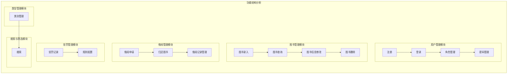

```mermaid
graph LR
  subgraph 功能结构分析
    subgraph 用户管理模块
      A[注册]
      B[登录]
      C[角色管理]
      D[密码管理]
    end
    subgraph 图书管理模块
      E[图书录入]
      F[图书查询]
      G[图书信息修改]
      H[图书删除]
    end
    subgraph 借阅管理模块
      I[借阅申请]
      J[归还图书]
      K[借阅记录管理]
    end
    subgraph 惩罚管理模块
      L[惩罚记录]
      M[规则配置]
    end
    subgraph 类型管理模块
      N[类别管理]
    end
    subgraph 搜索与筛选模块
      O[搜索]
    end
  end
  A --> B --> C --> D
  E --> F --> G --> H
  I --> J --> K
  L --> M
  N --> O
```