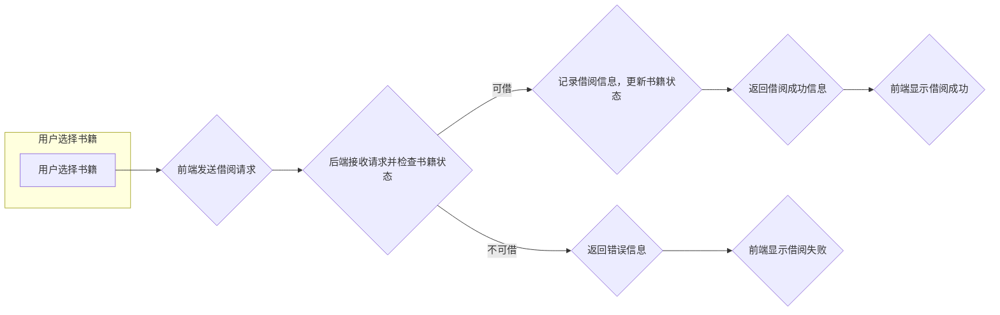

```mermaid
graph LR
  subgraph 用户选择书籍
    A[用户选择书籍]
  end
  A --> B{前端发送借阅请求}
  B --> C{后端接收请求并检查书籍状态}
  C -->|可借| D{记录借阅信息，更新书籍状态}
  C -->|不可借| E{返回错误信息}
  D --> F{返回借阅成功信息}
  F --> G{前端显示借阅成功}
  E --> H{前端显示借阅失败}

```