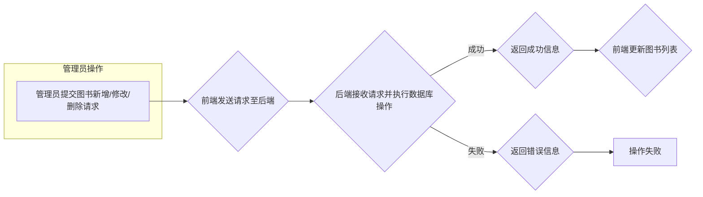

```mermaid
graph LR
  subgraph 管理员操作
    A[管理员提交图书新增/修改/删除请求]
  end
  A --> B{前端发送请求至后端}
  B --> C{后端接收请求并执行数据库操作}
  C -->|成功| D{返回成功信息}
  C -->|失败| E{返回错误信息}
  D --> F{前端更新图书列表}
  E --> G[操作失败]

```